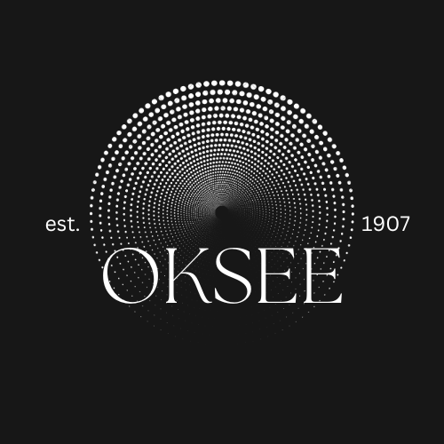

<p align="center">

</p>

# OKSee 

OKSee is a modern and simple cross platform mobile app showcasing the best parts of Oklahoma City, Oklahoma. The main staple of this mobile app is the modern, sleek, and simple UI/UX. All images, color-schemes, and software engineering was done and maintained by Noah Velasco. This repository will be supported until further notice.

<h3 align="center">Technologies Used</h3>
<p align="center">
<a href="https://reactnative.dev/docs/getting-started?guide=android" target="_blank" rel="noreferrer"> </a><a href="https://nodejs.org/en" target="_blank" rel="noreferrer"> </a><a href="https://www.npmjs.com" target="_blank" rel="noreferrer"> </a>
<a href="https://www.android.com" target="_blank" rel="noreferrer"> </a>
</p>

---
### Preview
TBA
<!-- <p align="center">


</p> -->

---
### Live Demo 
TBA

---
### Features / Todo's
- [x] Branding
- [ ] Splash Screen
- [ ] Landing Screen <=> Map Screen
- [ ] Weather Forecast Overlay
- [ ] Light/Dark mode
- [ ] Eateries Overlay Chip + Pins
- [ ] Cafés Overlay Chip + Pins
- [ ] Rooftop-Bars Overlay Chip + Pins
- [ ] Parks Overlay Chip + Pins
- [ ] Bottom Nav Bar (info-map-locations)
- [ ] QA
- [ ] Publish to App Store


---
### How to use
>**Note**: Make sure you have completed the [React Native - Environment Setup](https://reactnative.dev/docs/environment-setup) instructions till "Creating a new application" step, before proceeding.

1. Open 2 terminals A and B.

2. Start the Metro Server on Terminal A

```bash
# using npm
npm start

# OR using Yarn
yarn start
```

3. Start your Application on Terminal B

#### For Android

```bash
# using npm
npm run android

# OR using Yarn
yarn android
```

#### For iOS

```bash
# using npm
npm run ios

# OR using Yarn
yarn ios
```


---

### Build Info
* node --version v18.17.0
* npm --version 9.8.0
* npx react-native --version 0.72.3
* choco -v 1.1.0
--- 

### Possible Issues

* EXPO was NOT used
* AOS/iOS mobile version

---
### Sources


